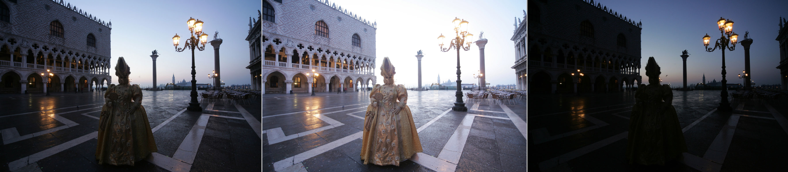
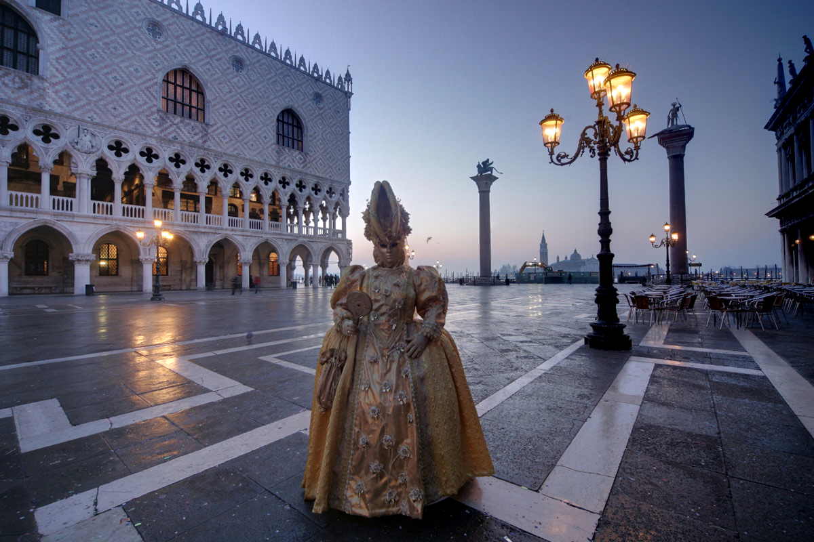

# Exposure Fusion (C++ Implementation)

### Basic Intro

Exposure fusion technique is for HDR image fusion task, which merely relies on simple quality measures, like saturation and contrast, which prove to be very
effective. This technique does not need to convert LDR images to HDR first and then use tone mapping to display HDR in LDR range, it use LDRs of multiple exposures to generate fused LDR output directly.

Exposure fusion uses Laplacian Pyramid fusion to conduct seamless combination. The alpha mask is calculated based on the contrast, saturation and well-exposedness of the LDR images.

### Preliminary Results

input multi-exposure images



fused output image



### Codebase Usage

simply run `sh run.sh` in the repo root folder to build and run the demo using the sample data from `./test_data/samples`, the results will be saved in `./test_data/result` folder.

If you would like to change the parameters in the algorithm, modify the initialization function in `./exposure_fusion/src/expo_fusion.cpp`, the parameters are as follows:

```c++
void initExpoFusionConfig(ExpoFusionConfig &config){

    config.pyrLevel = 10;

    config.saturationIndex = 1.f;
    config.contrastIndex = 1.f;
    config.wellExpoIndex = 1.f;

    config.contrastKernelSize = 3;
    config.wellExpoMean = 0.5f;
    config.wellExpoSigma = 0.2f;

    config.whitePercent = 0.01;
    config.blackPercent = 0.005;

}
```

### Authors

jia zhuang (jzsherlock@163.com)

### Reference

```latex
@inproceedings{mertens2009exposure,
  title={Exposure fusion: A simple and practical alternative to high dynamic range photography},
  author={Mertens, Tom and Kautz, Jan and Van Reeth, Frank},
  booktitle={Computer graphics forum},
  volume={28},
  number={1},
  pages={161--171},
  year={2009},
  organization={Wiley Online Library}
}

@article{hessel2018implementation,
  title={An implementation of the exposure fusion algorithm},
  author={Hessel, Charles},
  journal={Image Processing On Line},
  volume={8},
  pages={369--387},
  year={2018}
}

```
